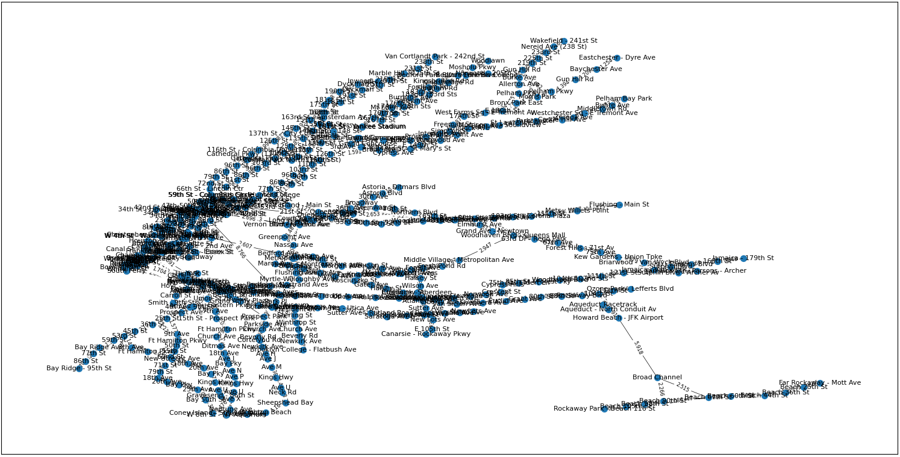

<h1 align="center">:metro: Implementação do Algoritmo de Dijkstra no metrô de Nova York</h1>

## :memo: Descrição
Projeto realizado na disciplina de Algoritmos e Estrutura de Dados, do curso de Sistemas de Informação da Universidade Federal de Pernambuco (UFPE), o qual tem como finalidade desenvolver um algoritmo para achar o menor caminho em um grafo ponderado. Para isso, criou-se um grafo a partir de um dataset público disponibilizado no site https://data.cityofnewyork.us/views/kk4q-3rt2/rows.csv em que os nós desse grafo representam as estações de metrô da cidade de Nova York e as arestas são as distâncias entre as estações. Assim, foi implementado o Algoritmo de Dijkstra para achar o menor caminho entre 2 estações conectadas, uma vez que não existem pesos negativos no grafo já que são dado pela distância entre estações.

## :wrench: Tecnologias utilizadas
- Python
- Pandas
- Networkx
- Matplotlib

## :rocket: Rodando o projeto
Execute o arquivo main.py para acessar a interface gráfica do projeto. Então escolha a estações de partida e estação de destino. Lembrando que nem todas estações estão conectadas, confira os grupos de estações que se conectam no arquivo do relatório do projeto (Anexo I).

## :camera: Imagens
  Execução do programa fazendo a busca do menor caminho entre as estações 7 e 164
  
 
 
  Plot do grafo com o menor caminho entre as estações 7 e 164
  
 
 
   Grafo completo
  
 
 
    Grafo completo sem o nome das estações e as distâncias
  
 

## ✒️ Autores

| [ Hallan Ângelo](https://github.com/hallanangelo) | [ Katharian Abrahel](https://github.com/katharianabrahel) |
| :-----------------------------------------------------------------------------------------------------------------------------------------: | :-------------------------------------------------------------------------------------------------------------------------------------: |
